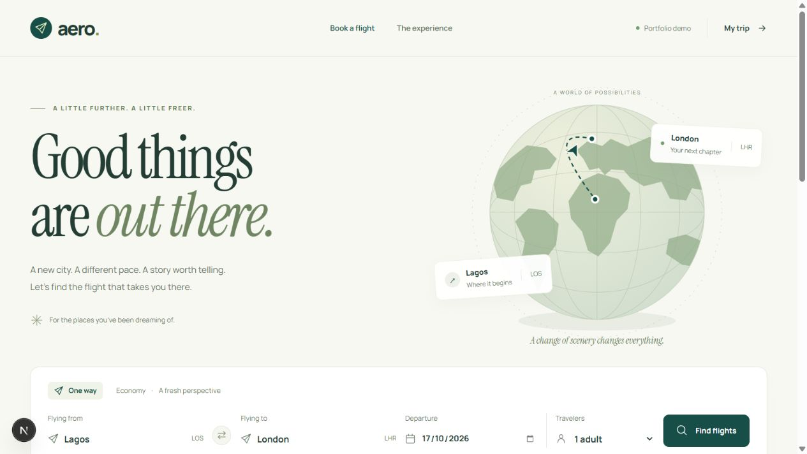

# Aero

A responsive flight booking application built with Next.js, React and TypeScript. Aero brings flight search, fare comparison, seat selection and checkout together in a complete booking interface, with an optional Duffel sandbox integration.

**[Live demo](https://aero-zeta-ruddy.vercel.app/) · [Architecture](docs/architecture.md) · [API setup](docs/sandbox-setup.md)**



> Aero is a portfolio demonstration. Sample bookings are simulated, and Duffel bookings use test mode. No real tickets are issued or payments collected.

## Features

- **Flight search and comparison** — airport selection, passenger counts, airline and budget filters, and sorting by price or duration.
- **Search state in the URL** — search criteria, filters and sorting remain available after refreshing or using browser navigation.
- **Interactive seat maps** — keyboard navigation and individual seat choices for each traveler and flight segment.
- **Booking flow** — optional baggage, itemized totals, review and printable demo confirmations.
- **Guided navigation** — persistent Back and Continue controls, visible step guidance and totals, and a shortcut to resume unfinished sample bookings.
- **Duffel sandbox integration** — provider test offers, current seat availability, baggage services and fictional traveler profiles.
- **Server price validation** — fresh fares and services are checked before creating a test order. Changed prices require a new review.
- **Booking recovery** — uncertain submissions can be checked against Duffel's saved orders without automatically submitting another booking.
- **Responsive interface** — layouts for mobile and desktop, loading and empty states, clear errors and focus management between booking steps.

## Technology

| Area | Tools |
| --- | --- |
| Application | Next.js App Router, React, TypeScript |
| Styling | Custom CSS, locally hosted Manrope and Instrument Serif fonts |
| API integration | Duffel test API through server-side route handlers |
| State | React state, a booking reducer, URL parameters and session storage |
| Deployment | Vercel |

## Architecture

The code is organized by feature. Routes compose the screens, feature modules own their data and booking rules, and shared components provide reusable interface elements.

```text
src/
├── app/                 Pages, layouts and server API routes
├── components/          Shared interface components and illustrations
├── data/                Supported airport data
├── features/
│   ├── flight-search/   Search form and URL helpers
│   ├── flight-results/  Provider adapters, results and filtering
│   ├── seat-selection/  Sample seat maps
│   ├── booking/         Sample booking state and confirmation
│   ├── sandbox-offer/   Provider itineraries and seat maps
│   └── sandbox-checkout/ Quotes, test orders and recovery
└── lib/                 Formatting and API request validation
```

### Key implementation decisions

- **Provider adapters:** sample and sandbox flight results share a display model. External API responses are normalized before reaching the interface.
- **Server-only credentials:** the Duffel token stays on the server. The browser sends requests to Aero's own API routes.
- **Money as integer minor units:** fares, seats and baggage totals are calculated without floating-point currency arithmetic.
- **Signed checkout quotes:** the server signs the selected options, total, currency and expiry, then rechecks current services before submission.
- **Provider-backed recovery:** confirmed test orders are stored by Duffel. Recovery verifies the offer, quote hash, currency and total before returning a receipt.

See the [architecture documentation](docs/architecture.md) for the data flow and implementation tradeoffs.

## Run locally

Requires Node.js 20.9 or newer and npm. Use Node.js 24 if running the existing domain test script.

```bash
git clone https://github.com/Dave9-wrld/aero.git
cd aero
npm ci
npm run dev
```

Open [http://localhost:3001](http://localhost:3001). The sample flight experience works without an API token.

### Optional Duffel sandbox setup

1. Create a Duffel **test** token with flight search and order permissions.
2. Copy `.env.example` to `.env.local` in the project root.
3. Set the server environment variable, then restart the development server:

```dotenv
DUFFEL_ACCESS_TOKEN=your_test_token_here
```

`.env.local` is ignored by Git. Keep the variable server-only; do not add a `NEXT_PUBLIC_` prefix. Live tokens and live offers are rejected.

For a complete setup reference, see [API setup](docs/sandbox-setup.md).

### Commands

| Command | Purpose |
| --- | --- |
| `npm run dev` | Start development on port 3001 |
| `npm run build` | Create a production build and check TypeScript |
| `npm start` | Serve the production build on port 3001 |
| `npm run typecheck` | Check TypeScript without building |
| `npm test` | Run the existing sample-domain tests |

Stop the development server before building in the same directory; both use `.next`.

## Deployment

Import the repository into Vercel using the Next.js preset. The sample experience needs no environment variables. To enable sandbox features, add `DUFFEL_ACCESS_TOKEN` as a sensitive server environment variable for the deployment.

Checkout uses Node.js route handlers and Duffel's saved order records. It does not require a writable local filesystem.

## Scope and limitations

- One-way economy searches for 1–4 adults, supported airports and currencies with two decimal places.
- Sandbox checkout uses fixed fictional profiles. Airlines requiring identity documents are not supported.
- Drafts and receipts are saved in the current browser tab; there is no account-based trip history.
- No real ticketing, card processing, cancellations, email delivery or live flight notifications.
- Request limiting is per server instance. A real booking service would also require shared submission records, authentication and operational reconciliation.
- Existing tests cover sample-domain logic, rather than the complete sandbox integration.

---

Built by [David Agbor](https://github.com/Dave9-wrld).
